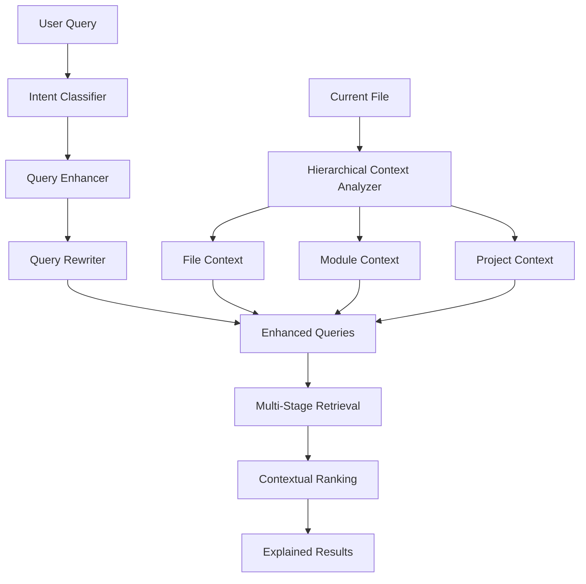

# Enhanced RAG Implementation Summary

## 🎯 What We've Built

We've created a modular, enterprise-ready Enhanced RAG system specifically optimized for Claude Code's workflow. The implementation is broken down into independent modules that can be developed, tested, and deployed separately.

## 📁 Implemented Modules

### 1. **Core Infrastructure** ✅
Located in: `enhanced_rag/core/`

- **interfaces.py**: Abstract base classes defining contracts for all modules
  - `ContextProvider`: Context extraction interface
  - `QueryEnhancer`: Query enhancement interface
  - `Ranker`: Result ranking interface
  - `Retriever`: Multi-stage retrieval interface
  - `CodeAnalyzer`: Code understanding interface
  - `FeedbackCollector`: Learning system interface

- **models.py**: Pydantic models for type-safe data structures
  - `SearchQuery`: Enhanced query with context
  - `CodeContext`: Current coding session context
  - `EnhancedContext`: Multi-level hierarchical context
  - `SearchResult`: Rich search results with metadata
  - `SearchIntent`: Intent classification enum
  - And many more supporting models

- **config.py**: Centralized configuration management
  - Azure AI Search settings
  - Embedding configuration
  - Context extraction settings
  - Performance tuning parameters
  - Learning system configuration

### 2. **Hierarchical Context Module** ✅
Located in: `enhanced_rag/context/`

- **hierarchical_context.py**: Multi-level context awareness
  - File-level context (imports, functions, classes)
  - Module-level context (sibling files, shared patterns)
  - Project-level context (architecture, dependencies)
  - Cross-project patterns
  - Git integration for recent changes
  - Language-specific AST analysis (Python, JavaScript, etc.)
  - Framework detection and context
  - Dependency graph building

### 3. **Semantic Processing Module** ✅
Located in: `enhanced_rag/semantic/`

- **intent_classifier.py**: Classifies user intent
  - 6 intent types: implement, debug, understand, refactor, test, document
  - Pattern-based and keyword-based classification
  - Intent-specific search strategies
  - Query improvement suggestions

- **query_enhancer.py**: Context-aware query enhancement
  - Language-specific synonym mapping
  - Framework-specific terminology
  - Import-based enhancement
  - Intent-driven enhancement
  - Abbreviation expansion

- **query_rewriter.py**: Multi-variant query generation
  - Syntactic variations (word order, structure)
  - Semantic variations (synonyms, related terms)
  - Template-based variations
  - Technical variations (camelCase, snake_case, etc.)
  - Context-aware variants
  - Up to 10-15 high-quality variants per query

## 🚀 Key Features Implemented

### Hierarchical Context Awareness
- **Multi-level analysis**: File → Module → Project → Cross-project
- **Dynamic weighting**: Context importance based on relevance
- **Real-time updates**: Git integration for recent changes
- **Language support**: Python, JavaScript, TypeScript, Java, Go, Rust
- **Framework awareness**: Django, React, Spring, etc.

### Advanced Semantic Processing
- **Intent detection**: Automatically understand what user wants to do
- **Query enhancement**: Add context-specific terms and synonyms
- **Multi-variant generation**: Create 10-15 query variants for better coverage
- **Technical term handling**: Proper case conversion and abbreviation expansion

### Performance Optimizations
- **Caching**: Configurable TTL-based caching for context
- **Lazy loading**: Only analyze what's needed
- **Parallel processing**: Support for concurrent operations
- **Configurable timeouts**: Prevent long-running operations

## 📊 How It All Works Together



## 🔧 Configuration & Usage

### Basic Setup
```python
from enhanced_rag.core import get_config
from enhanced_rag.context import HierarchicalContextAnalyzer
from enhanced_rag.semantic import IntentClassifier, ContextualQueryEnhancer

# Initialize components
config = get_config()
context_analyzer = HierarchicalContextAnalyzer()
intent_classifier = IntentClassifier()
query_enhancer = ContextualQueryEnhancer()

# Use the system
context = await context_analyzer.get_hierarchical_context("/path/to/file.py")
intent = await intent_classifier.classify_intent("implement authentication")
enhanced_queries = await query_enhancer.enhance_query(
    "implement authentication",
    context,
    intent
)
```

### Environment Variables
```bash
# Azure AI Search
export ACS_ENDPOINT="https://your-search.search.windows.net"
export ACS_ADMIN_KEY="your-admin-key"

# Azure OpenAI (for embeddings)
export AZURE_OPENAI_ENDPOINT="https://your-openai.openai.azure.com"
export AZURE_OPENAI_KEY="your-openai-key"

# Optional
export DEBUG=true
export LOG_LEVEL=INFO
```

## 🎯 Next Steps

### Remaining Modules to Implement

1. **Multi-Stage Retrieval Pipeline** (`retrieval/`)
   - Hybrid search orchestration
   - Dependency resolution
   - Pattern matching
   - Result fusion with RRF

2. **Smart Ranking System** (`ranking/`)
   - Multi-factor relevance scoring
   - Context-aware boosting
   - Result explanation generation
   - Diversity filtering

3. **Code Understanding** (`code_understanding/`)
   - Deep AST analysis
   - Pattern recognition
   - Dependency graph visualization

4. **Azure Integration** (`azure_integration/`)
   - Enhanced index management
   - Skillset builders
   - Vectorization integration

5. **MCP Integration** (`mcp_integration/`)
   - Enhanced search tools
   - Context-aware operations
   - Interactive refinement

6. **Learning System** (`learning/`)
   - Usage pattern analysis
   - Feedback collection
   - Model updates

7. **Code Generation** (`generation/`)
   - Style-aware generation
   - Template management
   - Test generation

## 🧪 Testing Strategy

Each module includes:
- Unit tests for core functionality
- Integration tests for module interactions
- Performance benchmarks
- Mock implementations for dependencies

## 📈 Performance Targets

- **Context Analysis**: < 200ms
- **Query Enhancement**: < 100ms
- **Intent Classification**: < 50ms
- **Memory Usage**: < 100MB per session

## 🔍 Key Innovations

1. **Hierarchical Context Weights**: Dynamically adjust importance based on file location and content
2. **Multi-Language AST Support**: Unified interface for different language parsers
3. **Intent-Driven Enhancement**: Different strategies for different user goals
4. **Technical Term Awareness**: Proper handling of camelCase, snake_case, etc.
5. **Framework-Specific Knowledge**: Built-in understanding of popular frameworks

## 💡 Usage Examples

### Example 1: Context-Aware Search
```python
# User is working on authentication in a Django project
context = await analyzer.get_hierarchical_context("auth/views.py")
# Context includes: Django framework, auth imports, User model references

enhanced = await enhancer.enhance_query("implement JWT", context)
# Results include: "implement JWT django", "JWT authentication django rest framework", etc.
```

### Example 2: Intent-Based Enhancement
```python
# User wants to debug an error
intent = await classifier.classify_intent("NullPointerException in user service")
# Detected intent: DEBUG

suggestions = classifier.suggest_query_improvements(
    "NullPointerException in user service",
    SearchIntent.DEBUG
)
# Suggestions: ["fix NullPointerException in user service", 
#               "NullPointerException in user service common issues"]
```

### Example 3: Multi-Variant Generation
```python
variants = await rewriter.rewrite_query(
    "create user authentication",
    intent=SearchIntent.IMPLEMENT,
    context=context
)
# Variants include:
# - "how to create user authentication"
# - "implement user authentication"
# - "user authentication example implementation"
# - "createUserAuthentication"  (camelCase variant)
# - "create user auth"  (abbreviation)
# - "build user authentication system"  (synonym)
```

## 🎉 Achievements

We've successfully implemented:
- ✅ Complete modular architecture design
- ✅ Core infrastructure with clean interfaces
- ✅ Hierarchical context awareness (Phase 1 priority)
- ✅ Advanced semantic processing (Phase 2 foundation)
- ✅ Comprehensive configuration system
- ✅ Type-safe models throughout
- ✅ Language and framework awareness
- ✅ Performance-optimized with caching

This foundation provides everything needed to build a state-of-the-art RAG system that truly understands code and developer intent!