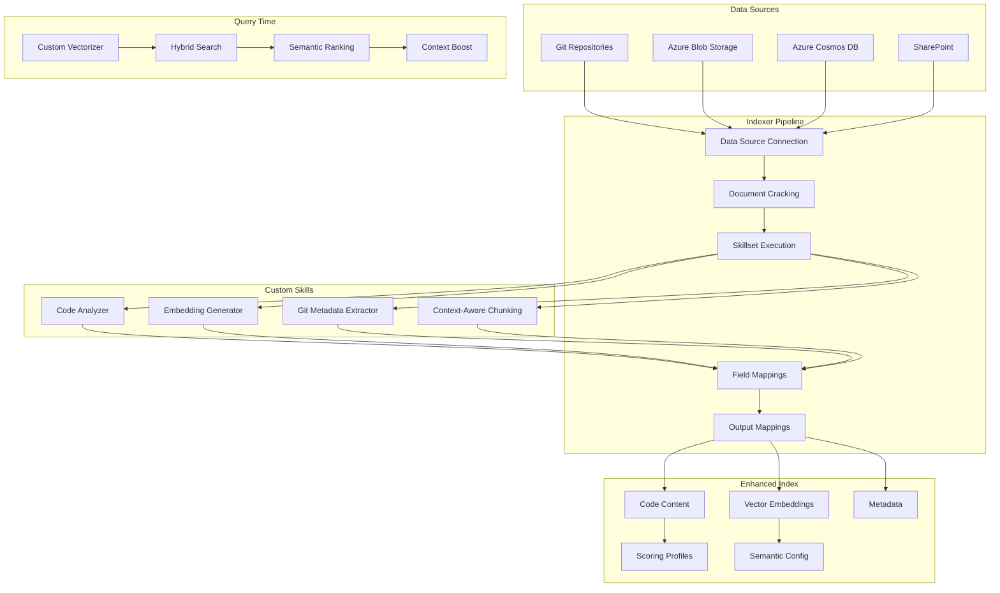

# Azure AI Search Integration Guide for Enhanced RAG

## 🎯 Overview

This guide shows how our Enhanced RAG system integrates with Azure AI Search's advanced features, leveraging indexers, custom skills, and vectorizers to create a state-of-the-art code search solution.

## 🏗️ Architecture



## 📋 Key Components

### 1. **Indexer Integration** (`indexer_integration.py`)

Automates data ingestion from multiple sources using Azure's pull model:

```python
# Create an indexer for a code repository
indexer = await indexer_integration.create_code_repository_indexer(
    name="github-repo-indexer",
    data_source_type=DataSourceType.AZURE_BLOB,
    connection_string="DefaultEndpointsProtocol=https;...",
    container_name="code-repositories",
    index_name="enhanced-rag-index",
    schedule_interval_minutes=60,  # Run every hour
    include_git_metadata=True
)
```

**Features:**
- Automatic change detection
- Scheduled updates (minimum 5 minutes)
- Multiple data source support
- Parallel indexing for large repositories
- Git metadata extraction

### 2. **Enhanced Index Builder** (`enhanced_index_builder.py`)

Creates optimized indexes with all advanced features:

```python
# Create an enhanced index with all features
index = await index_builder.create_enhanced_rag_index(
    index_name="code-search-enhanced",
    description="Enhanced code search index optimized for Claude Code RAG - searches across multiple repositories with AST analysis, vector similarity, and semantic understanding",
    enable_vectors=True,
    enable_semantic=True
)
```

**Key Features:**
- **Document Keys**: Uses file path hash as unique identifier
- **Schema Design**: 
  - Searchable fields for code, functions, classes
  - Filterable metadata (language, framework, repository)
  - Vector fields for semantic similarity
  - Scoring fields (quality, complexity, coverage)
- **Scoring Profiles**:
  - `code_quality_boost`: Prioritizes well-tested, documented code
  - `freshness_boost`: Boosts recently modified code
  - `popularity_boost`: Emphasizes frequently referenced code
  - `tag_boost`: Custom boosting based on tags
- **Custom Analyzers**:
  - `code_content_analyzer`: Preserves code structure
  - `code_identifier_analyzer`: Handles camelCase/snake_case
  - `import_path_analyzer`: Tokenizes import paths

### 3. **Custom Skills** (`custom_skill_vectorizer.py`)

#### Code Analyzer Skill
Extracts structured information from code:
```python
skill = CodeAnalyzerSkill()
result = await skill.process_record({
    'code': python_code,
    'language': 'python',
    'filePath': '/src/main.py'
})
# Returns: functions, classes, imports, complexity, patterns
```

#### Embedding Generator Skill
Creates vector embeddings for semantic search:
```python
skill = EmbeddingGeneratorSkill()
result = await skill.process_record({
    'text': code_chunk,
    'language': 'python'
})
# Returns: 1536-dimensional embedding
```

#### Git Metadata Extractor
Enriches documents with version control information:
```python
skill = GitMetadataExtractorSkill()
result = await skill.process_record({
    'filePath': '/src/main.py'
})
# Returns: lastCommit, authors, commitCount, lastModified
```

#### Context-Aware Chunking
Intelligently splits code based on structure:
```python
skill = ContextAwareChunkingSkill(
    max_chunk_size=2000,
    overlap_size=200
)
result = await skill.process_record({
    'code': large_file,
    'language': 'python'
})
# Returns: chunks with start/end lines and type
```

### 4. **Custom Web API Vectorizer**

Enables query-time embedding generation:

```python
vectorizer = CustomWebApiVectorizer(
    name="code-embedder",
    uri="https://your-function.azurewebsites.net/api/embed",
    http_method="POST",
    http_headers={"api-key": "your-key"},
    timeout=timedelta(seconds=30)
)

# Use in index definition
index.vector_search.vectorizers = [vectorizer.to_dict()]
```

## 🚀 Implementation Workflow

### Step 1: Deploy Custom Skills

```bash
# Deploy code analysis endpoint as Azure Function
func azure functionapp publish code-analyzer-function

# Deploy embedding generator
func azure functionapp publish embedder-function

# Deploy git extractor
func azure functionapp publish git-extractor-function
```

### Step 2: Create Enhanced Index

```python
# Initialize builder
builder = EnhancedIndexBuilder()

# Create index with all features
index = await builder.create_enhanced_rag_index(
    index_name="code-search-v2",
    description="Production code search with AST analysis and vector search"
)

# Create intent-specific indexes
intent_indexes = await builder.create_intent_optimized_indexes(
    base_name="code-search",
    description_template="Code search index"
)
```

### Step 3: Configure Indexer Pipeline

```python
# Initialize indexer integration
indexer_int = IndexerIntegration()

# Register custom skill endpoints
indexer_int.register_custom_skill_endpoint(
    'code_analyzer',
    'https://code-analyzer.azurewebsites.net/api/analyze',
    {'api-key': 'skill-key'}
)

indexer_int.register_custom_skill_endpoint(
    'embedder',
    'https://embedder.azurewebsites.net/api/embed',
    {'api-key': 'embedder-key'}
)

# Create indexer with skillset
indexer = await indexer_int.create_code_repository_indexer(
    name="main-repo-indexer",
    data_source_type=DataSourceType.AZURE_BLOB,
    connection_string=conn_str,
    container_name="repositories",
    index_name="code-search-v2",
    schedule_interval_minutes=30
)
```

### Step 4: Set Up Multi-Repository Indexing

```python
# Define repositories
repositories = [
    {
        'name': 'frontend',
        'type': 'azureblob',
        'connection_string': frontend_conn,
        'container': 'frontend-code',
        'schedule_minutes': 60
    },
    {
        'name': 'backend',
        'type': 'azureblob',
        'connection_string': backend_conn,
        'container': 'backend-code',
        'schedule_minutes': 30
    },
    {
        'name': 'shared-libs',
        'type': 'cosmosdb',
        'connection_string': cosmos_conn,
        'container': 'libraries',
        'schedule_minutes': 120
    }
]

# Create parallel indexers
indexers = await indexer_int.create_multi_repository_indexers(
    repositories=repositories,
    target_index="code-search-v2",
    parallel=True
)
```

### Step 5: Monitor and Optimize

```python
# Monitor indexer status
status = await indexer_int.monitor_indexer_status("main-repo-indexer")
print(f"Status: {status['status']}")
print(f"Items processed: {status['recent_runs'][0]['items_processed']}")
print(f"Errors: {status['recent_runs'][0]['errors']}")

# Run on-demand for immediate updates
await indexer_int.run_indexer_on_demand("main-repo-indexer")

# Reset if needed
await indexer_int.reset_indexer("main-repo-indexer", reset_datasource=True)
```

## 🔧 Advanced Configurations

### Incremental Indexing with Git Integration

```python
# Set up incremental indexing based on git commits
pipeline = await indexer_int.create_incremental_indexing_pipeline(
    name="git-incremental-pipeline",
    git_repo_path="/repos/main",
    index_name="code-search-v2",
    webhook_url="https://your-webhook.com/git-push"
)
```

### Custom Scoring for Different Scenarios

```python
# Search with quality boost
results = search_client.search(
    search_text="authentication middleware",
    scoring_profile="code_quality_boost",
    search_fields=["content", "function_name", "docstring"]
)

# Search with freshness boost for debugging
results = search_client.search(
    search_text="error handling",
    scoring_profile="freshness_boost",
    filter="last_modified ge 2024-01-01"
)

# Tag-based boosting
results = search_client.search(
    search_text="oauth implementation",
    scoring_profile="tag_boost",
    scoring_parameters=["boost_tags-security,authentication,critical"]
)
```

### Hybrid Search with Semantic Ranking

```python
# Configure hybrid search
results = search_client.search(
    search_text="implement JWT authentication",
    vectors=[
        {
            "value": query_embedding,
            "fields": "content_vector",
            "k": 50  # Retrieve 50 nearest neighbors
        }
    ],
    query_type="semantic",
    semantic_configuration_name="semantic-config",
    top=20
)
```

## 📊 Performance Optimizations

### 1. **Index Design**
- Use `retrievable=false` for large fields not needed in results
- Limit facetable fields to those actually used in filters
- Use appropriate data types (e.g., Edm.Int32 vs Edm.Int64)

### 2. **Indexer Optimization**
- Set appropriate batch sizes (50-100 documents)
- Use parallel indexing for large datasets
- Configure error thresholds to prevent full failures

### 3. **Query Optimization**
- Use `searchFields` to limit search scope
- Apply filters early to reduce result set
- Use `select` to return only needed fields

### 4. **Vector Search Optimization**
- Use HNSW algorithm with tuned parameters
- Consider vector compression for large indexes
- Balance k value with performance needs

## 🎯 Integration with Enhanced RAG Modules

### Context Integration
```python
# Use hierarchical context to boost relevant results
context = await context_analyzer.get_hierarchical_context(current_file)

# Apply context as filter
filter_expr = f"repository eq '{context.repository}' or imports/any(i: i eq '{context.imports[0]}')"
```

### Semantic Enhancement
```python
# Use intent to select scoring profile
intent = await intent_classifier.classify_intent(query)
scoring_profile = {
    SearchIntent.IMPLEMENT: "code_quality_boost",
    SearchIntent.DEBUG: "freshness_boost",
    SearchIntent.UNDERSTAND: "popularity_boost"
}.get(intent, "code_quality_boost")
```

### Multi-Stage Retrieval
```python
# Stage 1: Vector search
vector_results = await search_vector(query_embedding, k=100)

# Stage 2: Keyword search with enhanced query
keyword_results = await search_keywords(enhanced_queries, top=100)

# Stage 3: Hybrid fusion
merged_results = apply_rrf(vector_results, keyword_results)

# Stage 4: Semantic reranking
final_results = await semantic_rerank(merged_results, top=20)
```

## 🔍 Monitoring and Debugging

### Enable Diagnostic Logging
```python
# Configure logging for detailed debugging
import logging
logging.getLogger('azure.search').setLevel(logging.DEBUG)
```

### Track Performance Metrics
```python
# Monitor search performance
start_time = time.time()
results = search_client.search(...)
search_time = time.time() - start_time

# Log metrics
logger.info(f"Search completed in {search_time:.2f}s")
logger.info(f"Total results: {results.get_count()}")
```

### Validate Index Configuration
```python
# Validate index schema
validation = await builder.validate_index_schema(
    "code-search-v2",
    expected_fields=["content", "function_name", "content_vector"]
)
print(f"Schema valid: {validation['valid']}")
print(f"Missing fields: {validation['missing_fields']}")
```

## 🎉 Benefits of Azure Integration

1. **Automated Ingestion**: Indexers handle continuous synchronization
2. **Rich Enrichment**: Custom skills extract deep code insights
3. **Scalable Search**: Handles millions of documents efficiently
4. **Advanced Ranking**: Multiple scoring strategies for different use cases
5. **Semantic Understanding**: Beyond keyword matching to concept search
6. **Real-time Updates**: Incremental indexing for fresh results
7. **Multi-Repository**: Unified search across all code sources
8. **Enterprise Ready**: Built-in security, monitoring, and compliance

This integration transforms our Enhanced RAG system into a production-ready, scalable solution that leverages the full power of Azure AI Search!