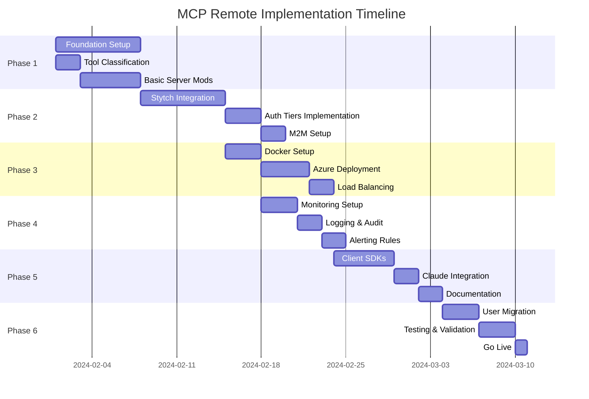

# Remote MCP Server Implementation Plan with Stytch Authentication

## Executive Summary
Enable secure remote access to all 30+ MCP tools using Stytch authentication, maintaining backward compatibility while adding enterprise-grade security and scalability.

## Phase 1: Foundation (Week 1-2)

### 1.1 Tool Security Classification

```yaml
# Tool Security Tiers
Tier 1 - Public Read (Magic Link Only):
  - search_code
  - search_code_raw  
  - search_microsoft_docs
  - explain_ranking
  - preview_query_processing
  - health_check
  - index_status
  - cache_stats

Tier 2 - Developer (Team Membership Required):
  - generate_code
  - analyze_context
  - submit_feedback
  - track_search_click
  - track_search_outcome

Tier 3 - Admin (MFA + Explicit Permission):
  - index_rebuild
  - github_index_repo
  - manage_index
  - manage_documents
  - manage_indexer
  - create_datasource
  - create_skillset
  - rebuild_index
  - configure_semantic_search
  - cache_clear
  - All write operations

Service Accounts (M2M Tokens):
  - CI/CD pipelines
  - Automated indexing
  - Monitoring systems
```

### 1.2 Stytch Configuration

```python
# mcprag/auth/stytch_config.py
from enum import Enum
from typing import Set

class AuthTier(Enum):
    PUBLIC = "public"
    DEVELOPER = "developer"
    ADMIN = "admin"
    SERVICE = "service"

TOOL_PERMISSIONS = {
    AuthTier.PUBLIC: {
        "search_code", "search_code_raw", "search_microsoft_docs",
        "explain_ranking", "preview_query_processing", 
        "health_check", "index_status", "cache_stats"
    },
    AuthTier.DEVELOPER: {
        *TOOL_PERMISSIONS[AuthTier.PUBLIC],
        "generate_code", "analyze_context",
        "submit_feedback", "track_search_click", "track_search_outcome"
    },
    AuthTier.ADMIN: {
        *TOOL_PERMISSIONS[AuthTier.DEVELOPER],
        "index_rebuild", "github_index_repo", "manage_index",
        "manage_documents", "manage_indexer", "create_datasource",
        "create_skillset", "rebuild_index", "configure_semantic_search",
        "cache_clear"
    },
    AuthTier.SERVICE: TOOL_PERMISSIONS[AuthTier.ADMIN]  # Full access for M2M
}

STYTCH_CONFIG = {
    "project_id": os.getenv("STYTCH_PROJECT_ID"),
    "secret": os.getenv("STYTCH_SECRET"),
    "environment": os.getenv("STYTCH_ENV", "test"),
    "session_duration_minutes": 480,  # 8 hours
    "mfa_required_for_admin": True,
    "allowed_email_domains": ["company.com"],  # Optional domain restriction
}
```

### 1.3 Server Modifications

```python
# mcprag/remote_server.py
from fastapi import FastAPI, Request, HTTPException, Depends
from fastapi.middleware.cors import CORSMiddleware
from sse_starlette.sse import EventSourceResponse
import stytch
from mcprag.server import MCPServer
from mcprag.auth.stytch_auth import StytchAuthenticator

app = FastAPI(title="MCP Remote Server")

# CORS for web clients
app.add_middleware(
    CORSMiddleware,
    allow_origins=os.getenv("ALLOWED_ORIGINS", "*").split(","),
    allow_credentials=True,
    allow_methods=["GET", "POST"],
    allow_headers=["*"],
)

# Initialize components
mcp_server = MCPServer()
auth = StytchAuthenticator()

@app.on_event("startup")
async def startup():
    """Initialize async components"""
    await mcp_server.start_async_components()
    await auth.initialize()

@app.on_event("shutdown")
async def shutdown():
    """Cleanup async components"""
    await mcp_server.cleanup_async_components()

# Authentication endpoints
@app.post("/auth/login")
async def login(email: str):
    """Initiate Stytch magic link flow"""
    return await auth.send_magic_link(email)

@app.get("/auth/callback")
async def auth_callback(token: str):
    """Handle Stytch callback"""
    session = await auth.complete_authentication(token)
    return {
        "session_token": session.token,
        "expires_at": session.expires_at,
        "user_tier": session.tier
    }

@app.post("/auth/mfa/verify")
async def verify_mfa(user_id: str, totp_code: str):
    """Verify MFA for admin operations"""
    return await auth.verify_totp(user_id, totp_code)

# MCP endpoints
@app.post("/mcp/tool/{tool_name}")
async def execute_tool(
    tool_name: str,
    request: Request,
    user=Depends(auth.get_current_user)
):
    """Execute MCP tool with auth checks"""
    # Check permissions
    if not auth.user_can_access_tool(user, tool_name):
        raise HTTPException(403, f"Insufficient permissions for {tool_name}")
    
    # Additional MFA check for admin tools
    if tool_name in ADMIN_TOOLS and not user.get("mfa_verified"):
        raise HTTPException(403, "MFA verification required")
    
    # Execute tool
    body = await request.json()
    result = await mcp_server.execute_tool(tool_name, body, user)
    
    # Audit log
    await audit_log(user, tool_name, body, result)
    
    return result

@app.get("/mcp/sse")
async def sse_endpoint(
    request: Request,
    user=Depends(auth.get_current_user)
):
    """SSE endpoint for streaming responses"""
    async def event_generator():
        async for event in mcp_server.get_events(user):
            yield {
                "event": "mcp_response",
                "data": event
            }
    
    return EventSourceResponse(event_generator())

@app.get("/health")
async def health_check():
    """Unauthenticated health check"""
    return {
        "status": "healthy",
        "version": "1.0.0",
        "transport": ["rest", "sse"]
    }
```

## Phase 2: Authentication Implementation (Week 2-3)

### 2.1 Stytch Integration Layer

```python
# mcprag/auth/stytch_auth.py
import stytch
from redis import asyncio as aioredis
from datetime import datetime, timedelta

class StytchAuthenticator:
    def __init__(self):
        self.client = stytch.Client(
            project_id=STYTCH_CONFIG["project_id"],
            secret=STYTCH_CONFIG["secret"]
        )
        self.redis = None
        
    async def initialize(self):
        """Initialize Redis for session storage"""
        self.redis = await aioredis.from_url(
            os.getenv("REDIS_URL", "redis://localhost")
        )
    
    async def send_magic_link(self, email: str):
        """Send magic link with tier determination"""
        # Determine user tier based on email/existing user
        tier = await self.determine_user_tier(email)
        
        response = await self.client.magic_links.email.login_or_create(
            email=email,
            login_magic_link_url=f"{BASE_URL}/auth/callback",
            signup_magic_link_url=f"{BASE_URL}/auth/callback",
            login_expiration_minutes=15,
            attributes={
                "tier": tier.value,
                "created_via": "mcp_remote"
            }
        )
        
        return {
            "status": "sent",
            "user_id": response.user_id,
            "tier": tier.value
        }
    
    async def complete_authentication(self, token: str):
        """Complete auth and create session"""
        # Authenticate with Stytch
        resp = await self.client.magic_links.authenticate(
            token=token,
            session_duration_minutes=STYTCH_CONFIG["session_duration_minutes"]
        )
        
        # Create internal session
        session_id = secrets.token_urlsafe(32)
        session_data = {
            "user_id": resp.user.user_id,
            "email": resp.user.emails[0].email,
            "tier": resp.user.trusted_metadata.get("tier", "public"),
            "stytch_session": resp.session_token,
            "expires_at": resp.session.expires_at.isoformat(),
            "mfa_verified": False
        }
        
        # Store in Redis with TTL
        await self.redis.setex(
            f"session:{session_id}",
            STYTCH_CONFIG["session_duration_minutes"] * 60,
            json.dumps(session_data)
        )
        
        return {
            "token": session_id,
            "expires_at": resp.session.expires_at,
            "tier": session_data["tier"]
        }
    
    async def get_current_user(self, authorization: str = Header(None)):
        """Dependency for FastAPI routes"""
        if not authorization or not authorization.startswith("Bearer "):
            raise HTTPException(401, "Missing authorization")
        
        token = authorization.replace("Bearer ", "")
        session_data = await self.redis.get(f"session:{token}")
        
        if not session_data:
            raise HTTPException(401, "Invalid or expired session")
        
        return json.loads(session_data)
    
    def user_can_access_tool(self, user: dict, tool_name: str) -> bool:
        """Check if user tier permits tool access"""
        user_tier = AuthTier(user.get("tier", "public"))
        allowed_tools = TOOL_PERMISSIONS.get(user_tier, set())
        return tool_name in allowed_tools
```

### 2.2 M2M Authentication for Services

```python
# mcprag/auth/m2m.py
class M2MAuthenticator:
    """Machine-to-machine authentication for CI/CD"""
    
    async def create_service_account(self, name: str, allowed_tools: List[str]):
        """Create M2M credentials"""
        response = await self.client.m2m.clients.create(
            client_name=name,
            client_description=f"Service account for {name}",
            trusted_metadata={"allowed_tools": allowed_tools}
        )
        
        return {
            "client_id": response.m2m_client.client_id,
            "client_secret": response.m2m_client.client_secret,
            "allowed_tools": allowed_tools
        }
    
    async def authenticate_m2m(self, client_id: str, client_secret: str):
        """Authenticate service account"""
        response = await self.client.m2m.token.authenticate(
            client_id=client_id,
            client_secret=client_secret,
            scopes=["read:mcp", "write:mcp"]
        )
        
        return {
            "access_token": response.access_token,
            "expires_in": response.expires_in,
            "tier": AuthTier.SERVICE
        }
```

## Phase 3: Deployment Architecture (Week 3-4)

### 3.1 Infrastructure Setup

```yaml
# docker-compose.yml
version: '3.8'

services:
  mcp-server:
    build: .
    ports:
      - "8001:8001"
    environment:
      - ACS_ENDPOINT=${ACS_ENDPOINT}
      - ACS_QUERY_KEY=${ACS_QUERY_KEY}  # Read-only key
      - STYTCH_PROJECT_ID=${STYTCH_PROJECT_ID}
      - STYTCH_SECRET=${STYTCH_SECRET}
      - REDIS_URL=redis://redis:6379
      - MCP_TRANSPORT=sse
    depends_on:
      - redis
    deploy:
      replicas: 3
      resources:
        limits:
          memory: 2G
          cpus: '1.0'
  
  mcp-admin:
    build: .
    ports:
      - "8002:8002"
    environment:
      - ACS_ENDPOINT=${ACS_ENDPOINT}
      - ACS_ADMIN_KEY=${ACS_ADMIN_KEY}  # Admin key
      - STYTCH_PROJECT_ID=${STYTCH_PROJECT_ID}
      - STYTCH_SECRET=${STYTCH_SECRET}
      - REDIS_URL=redis://redis:6379
      - MCP_ADMIN_MODE=true
    depends_on:
      - redis
    deploy:
      replicas: 1  # Single admin instance
  
  redis:
    image: redis:7-alpine
    ports:
      - "6379:6379"
    volumes:
      - redis-data:/data
    command: redis-server --appendonly yes

  nginx:
    image: nginx:alpine
    ports:
      - "443:443"
      - "80:80"
    volumes:
      - ./nginx.conf:/etc/nginx/nginx.conf
      - ./certs:/etc/nginx/certs
    depends_on:
      - mcp-server
      - mcp-admin

volumes:
  redis-data:
```

### 3.2 Nginx Configuration

```nginx
# nginx.conf
upstream mcp_read {
    least_conn;
    server mcp-server-1:8001;
    server mcp-server-2:8001;
    server mcp-server-3:8001;
}

upstream mcp_write {
    server mcp-admin:8002;
}

server {
    listen 443 ssl http2;
    server_name mcp.company.com;
    
    ssl_certificate /etc/nginx/certs/cert.pem;
    ssl_certificate_key /etc/nginx/certs/key.pem;
    
    # Rate limiting
    limit_req_zone $binary_remote_addr zone=api:10m rate=10r/s;
    limit_req zone=api burst=20 nodelay;
    
    # Read operations
    location ~ ^/mcp/tool/(search_|explain_|preview_|health|cache_stats|index_status) {
        proxy_pass http://mcp_read;
        proxy_set_header Host $host;
        proxy_set_header X-Real-IP $remote_addr;
    }
    
    # Write operations (admin)
    location ~ ^/mcp/tool/(manage_|create_|rebuild_|github_|configure_) {
        proxy_pass http://mcp_write;
        proxy_set_header Host $host;
        proxy_set_header X-Real-IP $remote_addr;
        
        # Additional security headers
        proxy_set_header X-Admin-Request "true";
    }
    
    # SSE endpoint
    location /mcp/sse {
        proxy_pass http://mcp_read;
        proxy_http_version 1.1;
        proxy_set_header Connection "";
        proxy_buffering off;
        proxy_cache off;
        
        # SSE specific
        proxy_set_header Cache-Control "no-cache";
        proxy_set_header X-Accel-Buffering "no";
    }
    
    # Auth endpoints
    location /auth/ {
        proxy_pass http://mcp_read;
        proxy_set_header Host $host;
    }
}
```

### 3.3 Azure Deployment

```yaml
# azure-deployment.yaml
apiVersion: apps/v1
kind: Deployment
metadata:
  name: mcp-remote
spec:
  replicas: 3
  selector:
    matchLabels:
      app: mcp-server
  template:
    metadata:
      labels:
        app: mcp-server
    spec:
      containers:
      - name: mcp
        image: mcprag.azurecr.io/mcp-server:latest
        ports:
        - containerPort: 8001
        env:
        - name: ACS_ENDPOINT
          valueFrom:
            secretKeyRef:
              name: mcp-secrets
              key: acs-endpoint
        - name: ACS_QUERY_KEY
          valueFrom:
            secretKeyRef:
              name: mcp-secrets
              key: acs-query-key
        - name: STYTCH_PROJECT_ID
          valueFrom:
            secretKeyRef:
              name: stytch-secrets
              key: project-id
        - name: STYTCH_SECRET
          valueFrom:
            secretKeyRef:
              name: stytch-secrets
              key: secret
        - name: REDIS_URL
          value: "redis://redis-service:6379"
        resources:
          requests:
            memory: "1Gi"
            cpu: "500m"
          limits:
            memory: "2Gi"
            cpu: "1000m"
        livenessProbe:
          httpGet:
            path: /health
            port: 8001
          initialDelaySeconds: 30
          periodSeconds: 10
        readinessProbe:
          httpGet:
            path: /health
            port: 8001
          initialDelaySeconds: 5
          periodSeconds: 5
---
apiVersion: v1
kind: Service
metadata:
  name: mcp-service
spec:
  selector:
    app: mcp-server
  ports:
  - port: 8001
    targetPort: 8001
  type: LoadBalancer
```

## Phase 4: Monitoring & Operations (Week 4-5)

### 4.1 Monitoring Setup

```python
# mcprag/monitoring/metrics.py
from prometheus_client import Counter, Histogram, Gauge
import time

# Metrics
tool_invocations = Counter(
    'mcp_tool_invocations_total',
    'Total tool invocations',
    ['tool', 'tier', 'status']
)

tool_duration = Histogram(
    'mcp_tool_duration_seconds',
    'Tool execution duration',
    ['tool']
)

active_sessions = Gauge(
    'mcp_active_sessions',
    'Number of active sessions',
    ['tier']
)

auth_failures = Counter(
    'mcp_auth_failures_total',
    'Authentication failures',
    ['reason']
)

class MetricsMiddleware:
    async def __call__(self, request, call_next):
        start_time = time.time()
        
        # Extract tool name from path
        tool_name = self.extract_tool_name(request.url.path)
        
        try:
            response = await call_next(request)
            
            if tool_name:
                tool_invocations.labels(
                    tool=tool_name,
                    tier=request.state.user_tier,
                    status='success'
                ).inc()
                
                tool_duration.labels(tool=tool_name).observe(
                    time.time() - start_time
                )
            
            return response
            
        except Exception as e:
            if tool_name:
                tool_invocations.labels(
                    tool=tool_name,
                    tier=request.state.user_tier or 'unknown',
                    status='error'
                ).inc()
            raise
```

### 4.2 Logging Configuration

```python
# mcprag/monitoring/logging.py
import structlog
from pythonjsonlogger import jsonlogger

# Configure structured logging
structlog.configure(
    processors=[
        structlog.stdlib.filter_by_level,
        structlog.stdlib.add_logger_name,
        structlog.stdlib.add_log_level,
        structlog.stdlib.PositionalArgumentsFormatter(),
        structlog.processors.TimeStamper(fmt="iso"),
        structlog.processors.StackInfoRenderer(),
        structlog.processors.format_exc_info,
        structlog.processors.UnicodeDecoder(),
        structlog.processors.JSONRenderer()
    ],
    context_class=dict,
    logger_factory=structlog.stdlib.LoggerFactory(),
    cache_logger_on_first_use=True,
)

async def audit_log(user: dict, tool: str, params: dict, result: dict):
    """Structured audit logging"""
    logger = structlog.get_logger()
    
    await logger.info(
        "tool_invocation",
        user_id=user["user_id"],
        user_email=user["email"],
        user_tier=user["tier"],
        tool=tool,
        params_hash=hashlib.sha256(
            json.dumps(params, sort_keys=True).encode()
        ).hexdigest(),
        result_status="success" if result.get("success") else "failure",
        timestamp=datetime.utcnow().isoformat()
    )
```

### 4.3 Alerting Rules

```yaml
# prometheus-alerts.yml
groups:
  - name: mcp_alerts
    rules:
      - alert: HighErrorRate
        expr: rate(mcp_tool_invocations_total{status="error"}[5m]) > 0.1
        for: 5m
        annotations:
          summary: "High error rate for MCP tools"
          description: "Error rate is {{ $value }} for {{ $labels.tool }}"
      
      - alert: SlowToolExecution
        expr: histogram_quantile(0.95, mcp_tool_duration_seconds) > 1
        for: 10m
        annotations:
          summary: "Tool execution is slow"
          description: "P95 latency is {{ $value }}s for {{ $labels.tool }}"
      
      - alert: AuthFailureSpike
        expr: rate(mcp_auth_failures_total[5m]) > 0.5
        for: 5m
        annotations:
          summary: "Authentication failure spike"
          description: "Auth failures: {{ $value }}/sec"
      
      - alert: AzureSearchDown
        expr: up{job="azure_search_health"} == 0
        for: 2m
        annotations:
          summary: "Azure Search is down"
          description: "Cannot connect to Azure Search"
```

## Phase 5: Client Integration (Week 5)

### 5.1 Web Client SDK

```typescript
// mcp-client-sdk.ts
class MCPRemoteClient {
    private sessionToken: string | null = null;
    private eventSource: EventSource | null = null;
    
    constructor(private baseUrl: string) {}
    
    async authenticate(email: string): Promise<void> {
        // Send magic link
        const response = await fetch(`${this.baseUrl}/auth/login`, {
            method: 'POST',
            body: JSON.stringify({ email }),
            headers: { 'Content-Type': 'application/json' }
        });
        
        if (!response.ok) {
            throw new Error('Failed to send magic link');
        }
        
        // Wait for user to complete auth (polling or webhook)
        // This is simplified - real implementation would be more sophisticated
    }
    
    async setSessionToken(token: string): Promise<void> {
        this.sessionToken = token;
        localStorage.setItem('mcp_session', token);
    }
    
    async executeTool(toolName: string, params: any): Promise<any> {
        if (!this.sessionToken) {
            throw new Error('Not authenticated');
        }
        
        const response = await fetch(`${this.baseUrl}/mcp/tool/${toolName}`, {
            method: 'POST',
            headers: {
                'Authorization': `Bearer ${this.sessionToken}`,
                'Content-Type': 'application/json'
            },
            body: JSON.stringify(params)
        });
        
        if (response.status === 403) {
            throw new Error('Insufficient permissions');
        }
        
        if (!response.ok) {
            throw new Error(`Tool execution failed: ${response.statusText}`);
        }
        
        return response.json();
    }
    
    connectSSE(onMessage: (event: any) => void): void {
        if (!this.sessionToken) {
            throw new Error('Not authenticated');
        }
        
        this.eventSource = new EventSource(
            `${this.baseUrl}/mcp/sse?token=${this.sessionToken}`
        );
        
        this.eventSource.onmessage = (event) => {
            const data = JSON.parse(event.data);
            onMessage(data);
        };
        
        this.eventSource.onerror = (error) => {
            console.error('SSE error:', error);
            this.reconnectSSE(onMessage);
        };
    }
    
    private reconnectSSE(onMessage: (event: any) => void): void {
        setTimeout(() => {
            this.connectSSE(onMessage);
        }, 5000);
    }
}

// Usage example
const client = new MCPRemoteClient('https://mcp.company.com');

// Authenticate
await client.authenticate('developer@company.com');
// User clicks magic link...
await client.setSessionToken(tokenFromCallback);

// Execute tool
const results = await client.executeTool('search_code', {
    query: 'authentication middleware',
    max_results: 10
});

// Connect to SSE for streaming
client.connectSSE((event) => {
    console.log('Received event:', event);
});
```

### 5.2 CLI Client Wrapper

```bash
#!/bin/bash
# mcp-remote-cli

MCP_CONFIG_FILE="$HOME/.mcp/config.json"
MCP_SERVER_URL="https://mcp.company.com"

# Function to authenticate
mcp_auth() {
    local email=$1
    echo "Sending magic link to $email..."
    
    response=$(curl -s -X POST "$MCP_SERVER_URL/auth/login" \
        -H "Content-Type: application/json" \
        -d "{\"email\":\"$email\"}")
    
    echo "Check your email and paste the session token:"
    read -s token
    
    # Save token
    mkdir -p "$(dirname "$MCP_CONFIG_FILE")"
    echo "{\"token\":\"$token\",\"server\":\"$MCP_SERVER_URL\"}" > "$MCP_CONFIG_FILE"
    
    echo "Authentication successful!"
}

# Function to execute tool
mcp_tool() {
    local tool=$1
    shift
    local params="$@"
    
    if [ ! -f "$MCP_CONFIG_FILE" ]; then
        echo "Not authenticated. Run: mcp-remote-cli auth <email>"
        exit 1
    fi
    
    token=$(jq -r .token "$MCP_CONFIG_FILE")
    
    curl -s -X POST "$MCP_SERVER_URL/mcp/tool/$tool" \
        -H "Authorization: Bearer $token" \
        -H "Content-Type: application/json" \
        -d "$params" | jq .
}

# Main command dispatcher
case "$1" in
    auth)
        mcp_auth "$2"
        ;;
    tool)
        mcp_tool "$2" "$3"
        ;;
    search)
        mcp_tool "search_code" "{\"query\":\"$2\",\"max_results\":10}"
        ;;
    *)
        echo "Usage: mcp-remote-cli [auth|tool|search] ..."
        exit 1
        ;;
esac
```

### 5.3 Claude Integration

```json
{
  "mcpServers": {
    "azure-code-search-remote": {
      "command": "node",
      "args": [
        "/usr/local/lib/node_modules/mcp-client-proxy/index.js",
        "--server-url", "https://mcp.company.com",
        "--auth-method", "stytch",
        "--session-file", "~/.mcp/session.json"
      ],
      "env": {
        "MCP_PROXY_MODE": "remote",
        "MCP_STYTCH_PROJECT": "project-live-xxx"
      }
    }
  }
}
```

## Phase 6: Migration & Rollout (Week 6)

### 6.1 Migration Script

```python
# scripts/migrate_to_remote.py
import asyncio
from typing import List

class RemoteMigration:
    """Migrate from local to remote MCP"""
    
    async def migrate_users(self, user_emails: List[str]):
        """Create Stytch users for existing users"""
        for email in user_emails:
            try:
                # Create user in Stytch
                user = await self.stytch.users.create(
                    email=email,
                    create_user_as_pending=True
                )
                
                # Determine tier based on historical usage
                tier = await self.determine_tier_from_usage(email)
                
                # Update user metadata
                await self.stytch.users.update(
                    user_id=user.user_id,
                    trusted_metadata={"tier": tier}
                )
                
                # Send onboarding email
                await self.send_onboarding_email(email, tier)
                
                print(f"Migrated {email} as {tier}")
                
            except Exception as e:
                print(f"Failed to migrate {email}: {e}")
    
    async def validate_remote_tools(self):
        """Test all tools work in remote mode"""
        test_results = {}
        
        for tool_name in ALL_TOOLS:
            try:
                # Test with appropriate tier
                tier = self.get_required_tier(tool_name)
                test_user = await self.create_test_user(tier)
                
                # Execute tool
                result = await self.test_tool_execution(
                    tool_name, 
                    test_user
                )
                
                test_results[tool_name] = "PASS"
                
            except Exception as e:
                test_results[tool_name] = f"FAIL: {e}"
        
        return test_results
```

### 6.2 Rollback Plan

```bash
#!/bin/bash
# rollback.sh

# Quick rollback to local mode
rollback_to_local() {
    echo "Rolling back to local MCP mode..."
    
    # Stop remote services
    docker-compose down
    
    # Restore local configuration
    cp ~/.mcp/config.backup.json ~/.mcp/config.json
    
    # Notify users
    ./scripts/notify_users.sh "MCP Remote temporarily unavailable. Please use local mode."
    
    echo "Rollback complete"
}

# Partial rollback (keep auth, revert to local execution)
partial_rollback() {
    echo "Switching to hybrid mode..."
    
    # Update nginx to route to local stdio bridge
    kubectl apply -f configs/nginx-hybrid.yaml
    
    # Keep Stytch auth active
    # Route execution to local servers via SSH
    
    echo "Now in hybrid mode: Remote auth, local execution"
}
```

## Implementation Timeline



## Success Metrics

| Metric | Target | Measurement |
|--------|--------|-------------|
| Authentication Success Rate | >99% | Stytch dashboard |
| Tool Execution Latency (P95) | <500ms | Prometheus |
| System Availability | 99.9% | Uptime monitoring |
| Session Duration | 8 hours avg | Redis analytics |
| MFA Adoption (Admin) | 100% | Stytch metrics |
| Concurrent Users | 100+ | Active sessions gauge |
| Cache Hit Rate | >70% | Redis metrics |
| Error Rate | <1% | Tool invocation metrics |

## Risk Mitigation

| Risk | Likelihood | Impact | Mitigation |
|------|------------|--------|------------|
| Stytch Outage | Low | High | Fallback to cached sessions + bearer tokens |
| DDoS Attack | Medium | High | Cloudflare + rate limiting |
| Token Compromise | Low | Medium | Short TTL + refresh tokens |
| Performance Degradation | Medium | Medium | Horizontal scaling + caching |
| Azure Search Limits | Low | High | Request queuing + backpressure |

## Environment Variables Summary

```bash
# Required for Remote MCP
export ACS_ENDPOINT="https://<search>.search.windows.net"
export ACS_QUERY_KEY="<query-key>"  # Read-only for search servers
export ACS_ADMIN_KEY="<admin-key>"  # Admin servers only
export STYTCH_PROJECT_ID="project-live-xxx"
export STYTCH_SECRET="<secret>"
export STYTCH_ENV="production"
export REDIS_URL="redis://redis:6379"
export MCP_TRANSPORT="sse"
export MCP_HOST="0.0.0.0"
export MCP_PORT="8001"
export MCP_ADMIN_MODE="false"  # true for admin servers
export BASE_URL="https://mcp.company.com"
export ALLOWED_ORIGINS="https://app.company.com,https://docs.company.com"
```

## Quick Start Commands

```bash
# Build and start locally
docker-compose up -d

# Deploy to Azure
kubectl apply -f azure-deployment.yaml

# Test authentication
curl -X POST https://mcp.company.com/auth/login \
  -H "Content-Type: application/json" \
  -d '{"email":"developer@company.com"}'

# Execute search tool (after auth)
curl -X POST https://mcp.company.com/mcp/tool/search_code \
  -H "Authorization: Bearer <token>" \
  -H "Content-Type: application/json" \
  -d '{"query":"authentication","max_results":10}'

# Monitor logs
docker-compose logs -f mcp-server

# Check metrics
curl https://mcp.company.com/metrics

# Run validation tests
python scripts/migrate_to_remote.py --validate

# Rollback if needed
./scripts/rollback.sh
```

## Support and Documentation

- **API Documentation**: https://mcp.company.com/docs
- **Client Libraries**: https://github.com/company/mcp-client-sdk
- **Monitoring Dashboard**: https://grafana.company.com/dashboard/mcp
- **Support Email**: mcp-support@company.com
- **Slack Channel**: #mcp-remote-support

## Conclusion

This implementation plan provides a complete, production-ready solution for enabling remote access to the MCP server with Stytch authentication. The phased approach ensures minimal disruption while adding enterprise-grade security, monitoring, and scalability. The plan includes all necessary code, configurations, and operational procedures for a successful deployment.